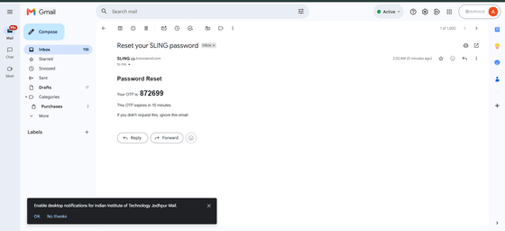
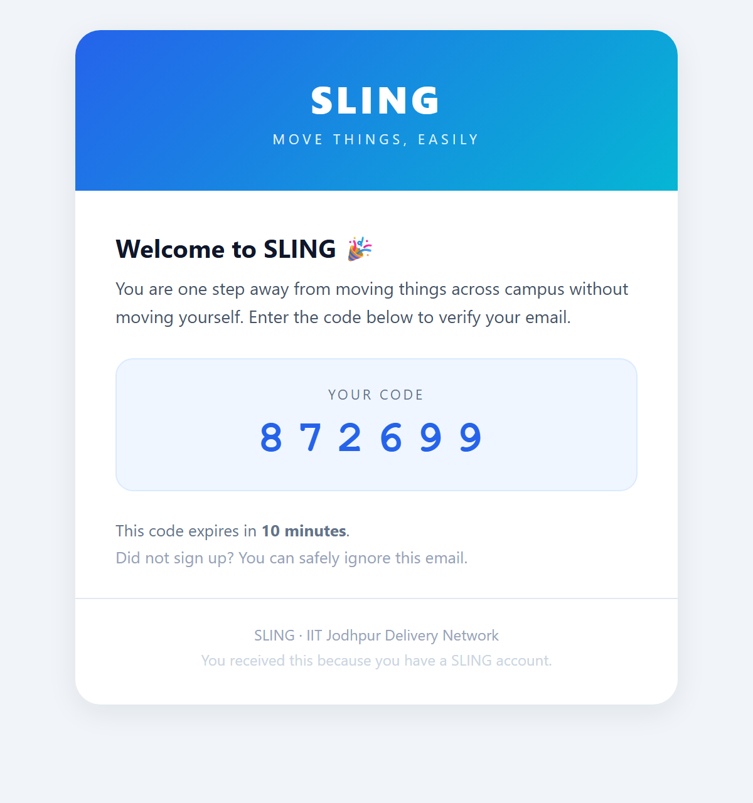

# SLING

Move things across campus without moving yourself.

SLING is a peer-to-peer delivery network built for IIT Jodhpur. If someone is already walking to the canteen, you can ask them to grab your Maggi on the way and leave a small tip(or a party) for the favour. There is no delivery fleet and no strangers at the gate, just students who are already going where you need something from.

## How it actually works

Picture 11 PM. You are buried in an assignment in your Hostel and you have run out of coffee.

1. You post a request: pick up from Neem Cafe, drop at Hostel, one cold coffee, tip twenty rupees(even a treat).
2. Ankita is already walking back from the Library past the cafe. She sees it in her feed and accepts.
3. She grabs the coffee and marks it picked up. If anything is unclear, the two of you can chat or call from inside the app.
4. She drops it off, you confirm delivery, and the tip goes through.
5. You both rate each other, which builds a reputation score for next time.

Nobody is locked into a role. Today you are the one asking. Tomorrow you are the one already walking that way and pocketing a few tips(even your tummy).

## What it does

- **Campus-only access.** Sign-up is restricted to iitj.ac.in email addresses and confirmed with a one-time code, so every account belongs to a verified student.
- **Post and accept requests.** Say what you need, where it is, where it goes, and what the tip is. Anyone heading that direction can pick it up.
- **One board, two roles.** No separate rider account. You act as requester or runner whenever it suits you.
- **A real delivery lifecycle.** Requests move through open, accepted, picked up, delivered, and completed, with proper cancel handling. The server enforces the order so nothing can jump ahead.
- **Live chat.** Once a request is accepted, both sides get a real-time chat, so "which gate are you at" gets answered right away.
- **Tips or a treat.** Every request carries a reward the two of you agree on: a small cash tip settled directly over UPI, or a party/treat you promise in person. Your call.
- **Two-way ratings.** Both people rate each other, and runners build a visible deliveries count and star rating.
- **Numbers on your terms.** Phone numbers stay hidden until you decide to share them.
- **Dark mode and notifications**, because a good chunk of campus life happens after sunset.

## The emails

Account emails are branded HTML, not plain text. Verification and password-reset codes arrive in a SLING-styled template with a gradient header, a clear code box, and a tidy footer. The templates live in `backend/src/utils/emailTemplates.js` and are shared across the verification, reset, and new-request emails.

<table>
<tr>
<td align="center"><b>Before</b><br/></td>
<td align="center"><b>After</b><br/></td>
</tr>
</table>

## Tech stack

Frontend runs on React 19 with Vite, styled with Tailwind CSS v4, using React Router, Axios, and the Socket.io client.

Backend is Node.js with Express 5, Socket.io for real-time, and Mongoose for data access.

Data lives in MongoDB Atlas. Auth uses JWT for stateless sessions, bcrypt for password hashing, and an email OTP for verification. Email goes through Brevo, using its HTTPS API in production (SMTP is blocked on many free hosts) with a Nodemailer SMTP fallback for local work.

## Project layout

```
campus-porter/
├── backend/
│   ├── app.js                  Express app, middleware, routes
│   ├── server.js               HTTP and Socket.io server bootstrap
│   ├── Dockerfile              container image for Koyeb or any host
│   └── src/
│       ├── config/db.js        MongoDB connection with pooling
│       ├── models/             User and Request schemas and indexes
│       ├── controllers/        auth and request logic
│       ├── routes/             REST route definitions
│       ├── middleware/auth.js  JWT verification
│       └── utils/              sendEmail (pluggable SMTP), generateOTP
└── frontend/
    └── src/
        ├── components/         SlingLogo, Navbar, ChatBox, ProtectedRoute, RequestCard
        ├── context/            AuthContext, ThemeContext
        ├── pages/              Login, Register, OTP, ForgotPassword, Home, Post, Detail, MyRequests, Profile
        ├── api/                axios API clients
        └── index.css           Tailwind plus the SLING motion styles
```

## Running it locally

You will need Node.js 18 or newer, a MongoDB Atlas connection string, and optionally an email account.

Backend:

```bash
cd backend
npm install
cp .env.example .env      # fill in the values
npm run dev               # http://localhost:3000
```

Frontend:

```bash
cd frontend
npm install
# create frontend/.env with VITE_API_URL=http://localhost:3000
npm run dev               # http://localhost:5173
```

## Environment variables

`backend/.env`:

```env
PORT=3000
MONGO_URI=your_mongodb_atlas_connection_string
JWT_SECRET=a_long_random_secret

EMAIL_USER=your_smtp_username_or_gmail@gmail.com
EMAIL_PASS=your_smtp_password_or_gmail_app_password
# Recommended in production (see the note below):
# EMAIL_HOST=smtp-relay.brevo.com
# EMAIL_PORT=587
# EMAIL_FROM=SLING <no-reply@yourdomain.com>
```

`frontend/.env`:

```env
VITE_API_URL=http://localhost:3000
```

A note on email. Gmail SMTP is fine on your laptop, but most free cloud hosts block outbound SMTP, which makes OTP emails hang or fail. In production, point `EMAIL_HOST` and `EMAIL_PORT` at a transactional provider such as Brevo or SendGrid. No code change is needed for that. `sendEmail` also has built-in timeouts, so a bad provider returns a clear error instead of freezing the request.

## Deployment

The backend is a long-running Express and Socket.io process, so it needs an always-on host rather than a serverless one.

The backend runs on Render's free tier, which supports WebSockets and builds straight from `backend/Dockerfile`. Create a web service from the GitHub repo, set the root directory to `backend`, choose the Docker runtime, add the environment variables (including the Brevo email settings), and deploy. Render's free instances sleep after fifteen minutes of inactivity, so a free uptime monitor (UptimeRobot or cron-job.org) pings the health endpoint every few minutes to keep it awake.

The frontend runs on Vercel as a static Vite build (`npm run build` produces `dist/`). A small `vercel.json` rewrites every route to `index.html` so client-side routing and page refreshes work. `VITE_API_URL` points at the Render backend URL, and any change to it needs a fresh deploy because it is baked in at build time.

Email goes through Brevo's HTTPS API rather than SMTP, because Render's free tier blocks outbound SMTP ports. It needs just two variables, `BREVO_API_KEY` and `EMAIL_FROM` (a Brevo-verified sender). The SMTP path is kept as a fallback for local development.

The database stays on MongoDB Atlas. Network Access is opened so the backend host can connect, and backups are turned on.

## Built to handle a full campus

The target is around five thousand students, and a few choices keep it comfortable there.

- Database connections are pooled instead of opened fresh on every request.
- Indexes cover the queries that actually run hot, such as the open-requests feed and a member's own requests.
- The feed uses lean reads so responses stay small and fast.
- New-request emails only reach people who opted in, which keeps both the inbox and the email quota under control.
- Auth is stateless JWT, so you can run more than one backend instance behind a load balancer whenever you outgrow one.

When live chat traffic outgrows a single instance, the next step is a Redis adapter for Socket.io (Upstash has a free tier) so multiple instances share the same chat rooms.

## How it came together

The full build story, phase by phase from the first campus noticeboard to the animated mobile app, lives in its own document.

**Read it here: [docs/DEVELOPMENT_PHASES.md](docs/DEVELOPMENT_PHASES.md)**

## Engineering report

Every failure, its root cause, and how it was solved is documented in a separate report, so this README stays about the product while the war stories live in one place.

**Read it here: [docs/ENGINEERING_REPORT.md](docs/ENGINEERING_REPORT.md)**

## Roadmap

- Redis adapter for multi-instance real-time
- Smart runner matching across the campus map
- Token-bucket rate limiting
- Installable mobile app with push notifications
- Scheduled and recurring requests

---

SLING. Because a coffee run at 11 PM should take one tap, not one trek.

Built for IIT Jodhpur.

Naming credit: SLING was dreamed up by me and my mate Gemini, after a long pile of rejected names and a few too many browser tabs. Gemini brought the wordplay, I kept the veto power.
